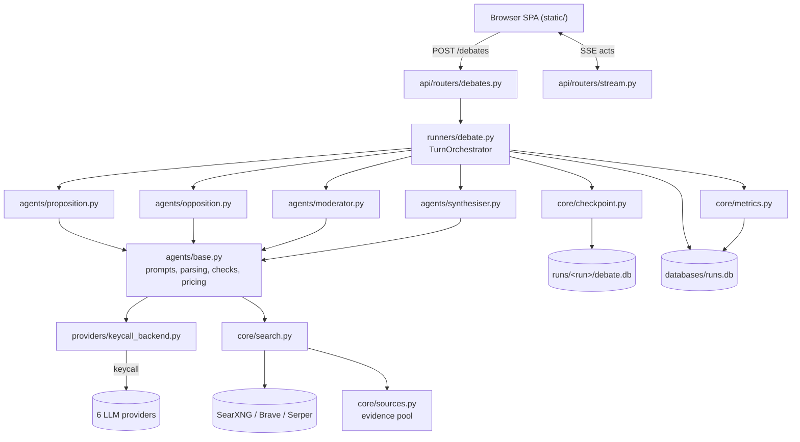
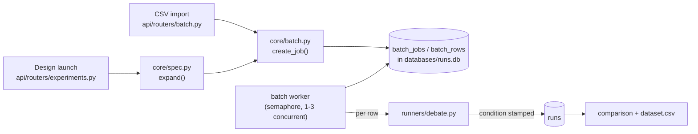

# Architecture

A STRuFO summary, then diagrams and reference tables for the turn loop, the data stores, the batch engine, and each module's contract.

## STRuFO

[S]hape, [T]echnical stack, [Ru]n details, [F]ailure modes, [O]bservability.

### Shape

Agora is a structured multi-agent debate system: a FastAPI server drives four LLM agents (Proposition, Opposition, Moderator, Synthesiser) through a typed speech-act protocol, grounds their claims through a neutral web-search layer, and records every act, source, token, and dollar into per-run SQLite files a browser SPA streams live. An experiment engine runs whole condition matrices as durable batches and compares the results.

### Technical stack

- **Language and framework:** Python 3.10+, FastAPI with uvicorn; async turn loop, no task queue beyond asyncio
- **UI:** hash-routed vanilla-JS single-page app (`static/`), ES modules, no build step, SSE for live updates
- **Storage:** SQLite only, two tiers: one registry database (`databases/runs.db`: runs index, experiments, batch jobs, run metrics, provider model registry) plus one `debate.db` per run under `runs/`
- **LLM access:** entirely through [keycall](https://pypi.org/project/keycall), which normalizes six providers (Anthropic, OpenAI, Google, Perplexity, Moonshot, xAI) into one client, one error taxonomy, and live model listings
- **Pricing:** [rates](https://pypi.org/project/rates) behind one seam (`core/cost.py`); every dollar figure is priced at generation time and recorded, never recomputed
- **Web search:** SearXNG, Brave, or Serper (first configured wins), falling back to the LLM provider's own search; page excerpts via `trafilatura`
- **Observability:** [traceact](https://pypi.org/project/traceact) spans on every agent call, search, and app action
- **Deployment:** local machine via `launch.command`; no cloud target

### Run details

#### Plain-English version

You give Agora a motion and pick a model for each seat. The proposition searches the web, asserts a claim with citations drawn only from what the search returned, and the opposition searches and attacks it from a rotating set of challenge angles. A moderator summarizes each turn and watches the stop conditions; when the token budget runs out or the debate resolves, it closes the session and a synthesiser draws the full argument map. Everything each agent said, cited, and spent is recorded in the run's own database, and the browser shows it live as it happens.

#### Technical version

- `POST /debates` (`api/routers/debates.py: create_debate`) validates the config, resolves every seat's model through the registry (`core/runs_db.py: resolve_model`), and schedules `_run_debate_wrapper` as a background task with an event queue and pause/close events.
- `runners/debate.py: run_debate` writes `config.json`, opens the run's `debate.db` (`core/checkpoint.py: init_db`), inserts the run into the registry index, binds the evidence pool (`core/sources.py: get_pool`), and hands off to `TurnOrchestrator.run`.
- Each debater turn: the agent writes a search query with its own model (`agents/base.py: _write_search_query`), executes it through the neutral chain (`core/search.py`), adds results to the pool, then `_traced_generate` builds the prompt (rolling history window, dialogue-state JSON, evidence pool, citation contract) and calls the provider via `providers/keycall_backend.py`.
- The response is parsed and checked twice (`agents/base.py`): legality (the act type is on the role's allowlist) and validity (the content isn't a false claim that context was missing), with up to two correction re-prompts that append to the original message. Citations not present in the pool are stripped, and each structured citation's verbatim quote is checked against the source's stored text with per-sentence number grounding (`core/citations.py`); on first citation of a source its full text is fetched once into the pool (`core/sources.py: ensure_full_text`).
- Prompts are fixed-size by construction: a rolling act-history window, chapter summaries carrying everything older (written every 10 debater turns, capped at 10 with the oldest half collapsing into an epoch summary), a bounded view of outstanding challenges (10 most recent in full, older as a count and digest), capped defence lists and URL-freshness sets in the opposition's audit, and windowed moderator turn cards. Challenges the debate has moved past — defended, then no opposition follow-up for 10 debater turns — lapse out of state (`core/state.py: lapse_stale_challenges`).
- The act is priced (`core/cost.py: cost_usd`), applied to state (`core/state.py: apply_act`), validated against the grammar (`core/grammar.py`), checkpointed (`core/checkpoint.py`), and pushed onto the SSE queue (`api/routers/stream.py` drains it to the browser).
- The moderator runs after each debater turn; `core/termination.py: check_termination` evaluates hard stops (turns, wall clock, token budget) and soft stops. On closure the synthesiser emits the argument map, the registry row gets final status/tokens/cost, and `core/metrics.py: compute_and_store` writes the run's metrics.

### Failure modes

| Cause | Handling |
|---|---|
| Transient provider failure (timeout, rate limit, outage, network) or fixable credential failure (spend limit, invalid key) | Interactive debates pause with a fix hint and retry the same call on Resume; unattended batch rows fail fast and rely on the batch retry button, since nobody would resume them (`runners/debate.py: _call_with_pause_on_failure`). Quota errors also set a warning badge on the key in Settings; sampling-parameter rejections retry with the parameter dropped (`providers/keycall_backend.py`) |
| Model output never parses as JSON, or claims its context was missing, after every correction attempt | `ResponseParseError` / `InvalidContentError` pause the same way (interactive) or fail the row (unattended) |
| A debater seat fails past recovery | The run still closes through the normal path: moderator close where possible, argument map from whatever record exists |
| One more turn would overrun the token budget | The turn is never launched: the runner projects the next turn as the larger of the last two whole-turn totals plus one retry of it (doubled, since a correction retry re-bills a full call) and closes ahead of the overrun |
| Fabricated citation | Stripped before the act is recorded; the act is marked unsourced (`agents/base.py: _enforce_citations`) |
| Quote not found in the cited source's stored text | One corrective retry names each failing quote (fix it or drop the citation), recorded on the act as `citation_repairs`; a quote still mismatched after it is marked `mismatch` and the act annotated as unsourced, with check results recorded on the act and surfaced to the moderator and opposition (`agents/base.py: _enforce_quotes`) |
| Quote matches only the source's headline | Marked `title_only`, excluded from verified: a title is stored text but substantiates nothing (`core/citations.py`, `core/sources.py: source_title_for`) |
| Judge model unroutable or judgement fails mid-run | Routing is checked before any billed call (400 at invocation); a failing judgement logs, stores nothing, and clears its in-flight marker so the run can be judged again (`api/routers/debates.py`) |
| Number in a citing sentence absent from its quote | Recorded as `ungrounded_numbers` on the citation and counted as a violation; surfaced the same way |
| Cited source can't be fetched for quote checks (bot wall, dead page) | The citation is `unverifiable`: no penalty (absence of text proves nothing), the fetch is not retried, and the status is surfaced for the opposition to weigh |
| Chapter or epoch summary call fails | Traced and logged, then swallowed; the debate loses summary detail, never the run. A failed epoch collapse retries at the next chapter |
| Model not resolvable to a single provider | `ModelNotRoutable` with the reason (unknown, or served by more than one vendor) at debate creation or CSV-row start, never mid-debate |
| Search tier down | Chain falls through SearXNG → Brave → Serper → provider search; a turn with no results proceeds unsourced |
| A model rates can't price | Cost records as None (unknown, not zero); totals show as minimums with a "partial" marker |
| Server dies mid-batch | On next start the worker stamps mid-flight rows `interrupted`; a retry button re-runs them as a new job (`core/batch.py`) |
| Batch spend reaches its ceiling | New rows stop launching and are marked skipped; running rows finish (`core/batch.py`) |
| Token budget exhausted mid-debate | Hard stop: moderator closes with `closure_reason: token_budget` |

### Observability

- Every debate is one `debate.run` traceact span keyed by run id, with nested `agent.generate` spans per call recording the full system and user prompt bodies, the raw model response, the model, provider, token counts, parse retries, citation-check results, and act type, plus `synthesiser.chapter` / `synthesiser.epoch` spans for the auxiliary summary calls and spans on searches and app actions (experiment CRUD, batch import, exports).
- Traces write to `data/traces/traces.jsonl` with 50MB rotation; the Traces screen queries them inline and launches the full traceact viewer pre-filtered to a run.
- Each run directory is self-describing after the fact: `debate.db` (every act with tokens, cost, challenge type, retry count), `sources.json` (the evidence pool), `search_log.jsonl` (every raw search response), `config.json`, `overrides.json`.
- The registry (`databases/runs.db`) holds the cross-run view: final status, tokens, cost, condition labels, computed `run_metrics`, and batch job/row history including per-row errors.
- A run pack export bundles the whole record (calls, queries, sources, citation checks, cost breakdown) into one artifact.
- Judgements live in `run_judgements` (registry DB), one row per run × config, each carrying its per-item verdicts and spend; `judge.fidelity` / `judge.map` / `judge.chain` spans record every judge call's full prompt and verdict.

## System diagram

## Batch and experiment engine

An experiment can store a spec (base config, factors with levels, replicate count). Launching expands it deterministically into condition-labelled rows and enqueues them as one job; extend adds replicates with numbering continued from the last launch. The first launch records a manifest (package versions, price snapshot date, git commit). CSV imports are stored back onto the experiment as explicit-rows specs, so both input paths are re-runnable.

## Module contracts

| Module | Responsibility | Depends on |
|---|---|---|
| `core/state.py` | Protocol data model, `apply_act`, challenge lapsing | nothing above stdlib |
| `core/citations.py` | Quote contract and number grounding checks | `core/sources.py` (URL normalisation) |
| `core/grammar.py` | Legal act transitions | `core/state.py` |
| `core/termination.py` | Stop conditions | `core/state.py`, `core/config.py` |
| `core/checkpoint.py` | Per-run persistence | `core/state.py` |
| `core/config.py` | Typed run config, defaults | `config/defaults.yaml` |
| `core/runs_db.py` | Registry DB: runs, experiments, batches, metrics, model registry | sqlite3 |
| `core/batch.py` | Durable batch execution | `core/runs_db.py`, `runners/` |
| `core/spec.py` | Spec validation and expansion | nothing above stdlib |
| `core/metrics.py` | Post-close metric computation | `core/runs_db.py` |
| `core/judge.py` | Model-graded quality scores (explicit, billed) | `providers/`, `core/citations.py`, `core/cost.py` |
| `core/cost.py` | Pricing seam over rates | rates (optional) |
| `core/search.py` | Neutral search chain | httpx, trafilatura |
| `core/sources.py` | Evidence pool | `core/search.py` types |
| `core/export.py` / `core/runpack.py` | Transcript and full-record exports | `core/state.py`, `core/cost.py` |
| `agents/*` | Role prompts and parsing on `BaseAgent` | `core/*`, `providers/` |
| `providers/keycall_backend.py` | All provider I/O | keycall |
| `runners/debate.py` | Turn loop, SSE, pause/close | agents, core |
| `api/*` | HTTP surface | everything above |
| `static/*` | Browser UI | the API only |

## Data stores

| Store | Contents | Lifetime |
|---|---|---|
| `databases/runs.db` | Runs index, experiments (spec, manifest), batch jobs/rows, run_metrics, provider model registry | Permanent, additive migrations only |
| `runs/<run>/debate.db` | Acts, claims, state snapshots for one run | Per run, authoritative for act detail |
| `runs/<run>/*.json*` | Config snapshot, evidence pool, search lockfile, overrides | Per run |
| `data/traces/traces.jsonl` | traceact spans | 50MB rotation |
| `.env` | API keys | Local only, never served or committed |

## Security considerations

- All agent prompts use a system/user split; agent content never enters the system prompt, and structural tags are stripped from input before prompt insertion.
- A per-role allowlist rejects any act type a role may not emit, so a cross-role injection can't move the protocol.
- Citations are constrained to the pool at prompt time and verified against it after generation, which makes an invented URL ineffective rather than merely discouraged.
- API keys live only in the local `.env`; the API reports key presence and validity but never returns key material.

## Development and testing

`pytest tests/` runs the full suite: protocol, adversarial inputs, provider dispatch and routing, cost tracking, the experiment engine, and the [shiplock](https://pypi.org/project/shiplock) docs-vs-code gate (`shiplock.toml`), also runnable standalone as `shiplock check`. Tests touching the registry point it at throwaway databases; nothing in the suite makes a billable call. The dev loop is `launch.command` (or `uvicorn api.main:app --reload`) with static files served no-store, so a hard reload picks up frontend edits while the server runs.

## Future considerations

Known debt, not a roadmap:

- Rolling model aliases (for example a provider's `-latest` id) price as unknown because the registry can't pin them to a dated snapshot.
- The evidence pool injects a newest-first subset into prompts; ranking policy for the working set is unsettled.
- Run metrics don't record pause counts; the runner doesn't persist them anywhere durable yet.

## Glossary

| Term | Meaning |
|---|---|
| Act | One typed speech act (ASSERT, CHALLENGE, STATUS, ...), the protocol's atomic unit |
| Claim | An asserted proposition tracked through challenge, revision, concession |
| Evidence pool | The per-run set of search results that is the only legal source of citations |
| Condition | The factor levels a spec-generated run represents, stamped on the run |
| Replicate | One repetition of a condition within an experiment design |
| Run pack | The complete auditable export of one debate |
| Registry | `databases/runs.db`, the cross-run index |
